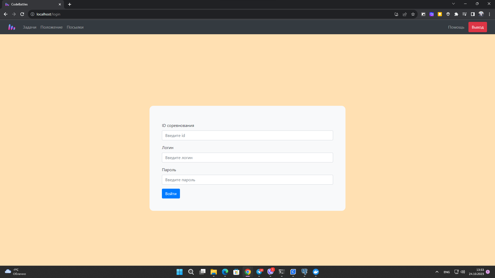

# Интерфейс участника

<figure><figcaption>
Страница входа
</figcaption></figure>

<figure><figcaption>
Задачи
</figcaption></figure>

<figure><figcaption>
Отправить решение
</figcaption></figure>

<figure><figcaption>
Ошибка подключения
</figcaption></figure>

<figure><figcaption>
Обзор задачи
</figcaption></figure>

<figure><figcaption>
Положение
</figcaption></figure>

<figure><figcaption>
Просмотр посылок
</figcaption></figure>

<figure><figcaption>
Статусы выполнения
</figcaption></figure>
