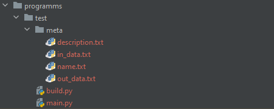

# Создание своей задачи

## Генерация шаблона задачи

Для удобной работы с задачами есть [TestsGeneratorFramework](https://github.com/doctorixx/TestsGeneratorFramework)\
Скачиваем его и заходим в основную папку, где есть _**manager.py**_

Для генерации задачи вводим в консоль ({NAME} - имя задачки)

```css
python manager.py create {NAME} -f -e
```

После этого в папке programms появилась наша папка( В примере {NAME} = test}

<figure><figcaption></figcaption></figure>

| Имя файла       | Предназначение         |
| --------------- | ---------------------- |
| description.txt | Описание задачи        |
| in\_data.txt    | Входные данные задачи  |
| name.txt        | Имя задачи             |
| out\_data.txt   | Выходные данные задачи |

| Имя файла | Предназначение                                                                  |
| --------- | ------------------------------------------------------------------------------- |
| build.py  | Файл для сборки задачи.(Рассмотрим позже)                                       |
| main.py   | Эталонная программа для данной задачи (Благодаря ей будут генерироваться тесты) |
|           |                                                                                 |

Теперь давайте рассмотрим содержимое файла build.py.

<mark style="color:green;">examples</mark> - словарь, где ключ - входные данные, значение - выходные\
<mark style="color:green;">input\_data</mark> - список с входными значениями, с которыми сгенерируются тесты

Для большего понимания рассмотрим страницу с задачей, что именно куда подставляется. И попробуем сделать такую же задачу



## Свои тесты для программы

Примеры напишем сами, а вот входные данные сгенерируем с помощью программы. \
Изменяем build.py и эталон программы


```python
n = int(input())
if n % 2 == 0:
    print("YES"
else:
    print("NO")

```




```python
from core.runner import Runner
from random import randint

runner = Runner()

examples = {
    "2": "YES",
    "3": "NO",
}

input_data = []

for i in range(30):
    input_data.append(randint(0, 100))

out = runner.run_many(input_data)
runner.save_tests(out, input_data)
runner.save_examples(examples)
runner.build(indent=2)
print("[+] Done")

```


## Изменяем описание

Также изменяем описание, входные и выходные данные. Показывать не буду, т.к будет много текста. Просто напишу везде _test_

<details>

<summary>Все файлы</summary>


```
test
```



```
test
```



```
test
```



```
test
```



</details>

## Генерация задачи

После всех шагов, запускаем _**build.py**_

<details>

<summary>Вывод</summary>

```
[/] Tests are running 
30/30 
[+] Tests was built
[/] Building export 
[+] Export was built 
[+] Done
```

</details>

***

У нас появился файл build.json . Это и есть наша сгенерированная задача. Ее мы будет загружать на платформу

Этот файл содержит все данные, тесты, примеры.

<details>

<summary>build.json</summary>

```json5
{
  "name": "test",
  "description": "test",
  "in": "test",
  "out": "test",
  "examples": {
    "2": "YES",
    "3": "NO"
  },
  "tests": [
    [
      "87",
      "NO"
    ],
    [
      "11",
      "NO"
    ],
    [
      "73",
      "NO"
    ],
    [
      "40",
      "YES"
    ],
    [
      "97",
      "NO"
    ],
    [
      "51",
      "NO"
    ],
    [
      "9",
      "NO"
    ],
    [
      "80",
      "YES"
    ],
    [
      "70",
      "YES"
    ],
    [
      "75",
      "NO"
    ],
    [
      "7",
      "NO"
    ],
    [
      "56",
      "YES"
    ],
    [
      "62",
      "YES"
    ],
    [
      "14",
      "YES"
    ],
    [
      "32",
      "YES"
    ],
    [
      "53",
      "NO"
    ],
    [
      "25",
      "NO"
    ],
    [
      "0",
      "YES"
    ],
    [
      "23",
      "NO"
    ],
    [
      "74",
      "YES"
    ],
    [
      "82",
      "YES"
    ],
    [
      "19",
      "NO"
    ],
    [
      "99",
      "NO"
    ],
    [
      "56",
      "YES"
    ],
    [
      "41",
      "NO"
    ],
    [
      "43",
      "NO"
    ],
    [
      "54",
      "YES"
    ],
    [
      "57",
      "NO"
    ],
    [
      "14",
      "YES"
    ],
    [
      "57",
      "NO"
    ]
  ]
}
```

</details>

<mark style="color:green;">**Готово!**</mark>
